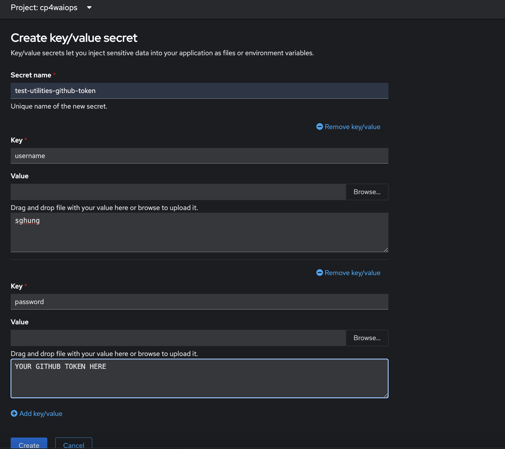
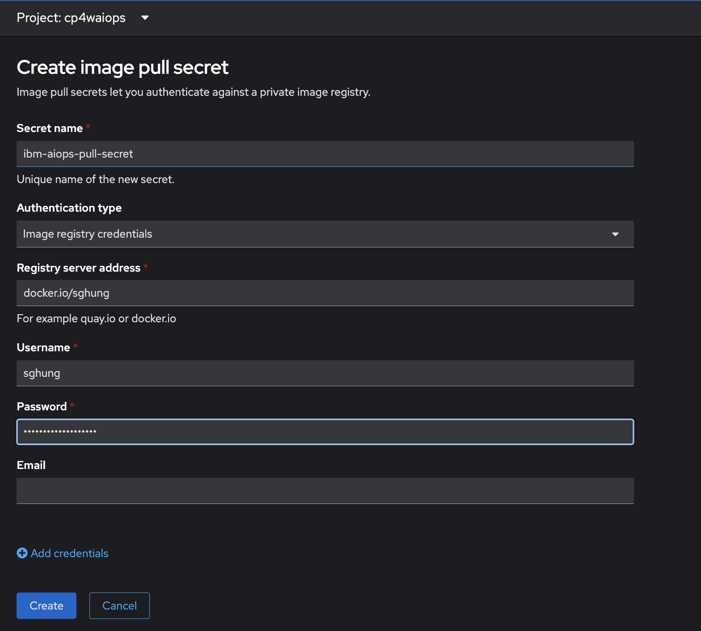

Normally I would fork the repository, but to ensure this quick star is in the official repo, I am just creating a branch.

Renamed integration to `ticket-system`. Using search and replacement for `ticket-template`

Updated `bundlemanifest.yaml` to use the GitHub repository and branch. In this case, the `repo` remains unchanged but the branch was changed to `sample01`

```yaml
apiVersion: connectors.aiops.ibm.com/v1beta1
kind: BundleManifest
metadata:
  name: ticket-system
spec:
  prereqs:
    repo: 'https://github.com/IBM/cp4aiops-connectors-ticket-template'
    branch: sample01
    authSecret:
      name: test-utilities-github-token
    components:
      - name: deployment
        path: /bundle-artifacts/prereqs
        type: kustomize
  instanced:
    repo: 'https://github.com/IBM/cp4aiops-connectors-ticket-template'
    branch: sample01
    authSecret:
      name: test-utilities-github-token
    components:
      - name: connector
        path: /bundle-artifacts/connector
        type: kustomize

```

Init and start Podman
```bash
podman machine start
```

I login to docker:
```bash
podman login docker.io/sghung
```

My kustomization.yaml file has this image name defined [bundle-artifacts/connector/kustomization.yaml](bundle-artifacts/connector/kustomization.yaml) and [bundle-artifacts/prereqs/kustomization.yaml](bundle-artifacts/prereqs/kustomization.yaml)

```yaml
images:
  - name: ticket-system
    newName: docker.io/sghung/ticket-system
    newTag: latest
```

I build my image:
```bash
podman build -f container/Dockerfile -t docker.io/sghung/ticket-system:latest .
```

After the image is built, push it:
```bash
podman push docker.io/sghung/ticket-system:latest
```

Create the GitHub secret for pulling from our repository.

Login to OpenShift CLI:
Create the `test-utilities-github-token` key value secret. The `username` is your GitHub user name and `password` is your personal access token:


Create the image pull secret. The image pull secret is defined as `ibm-aiops-pull-secret`, so you can pull from Docker



Now apply the bundlemanifest.yaml. Call:
```
oc apply -f bundlemanifest.yaml
```