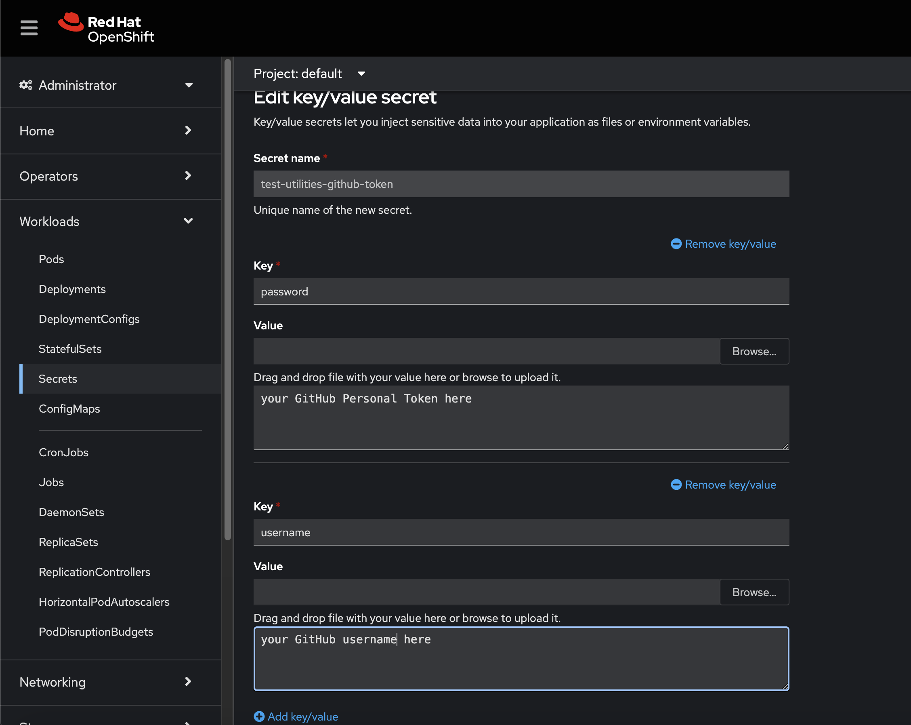
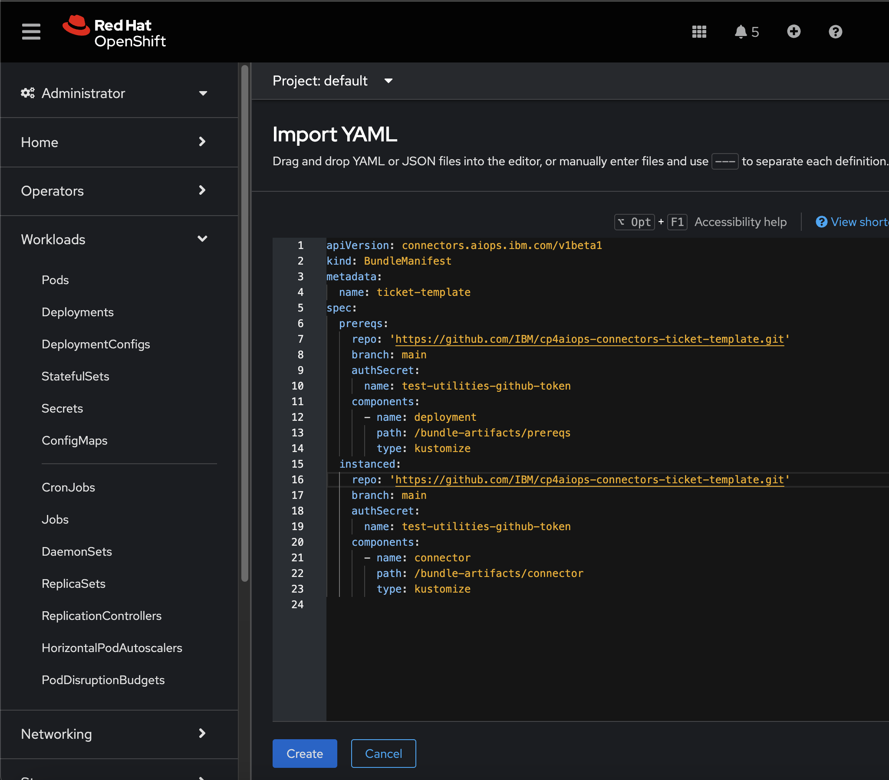
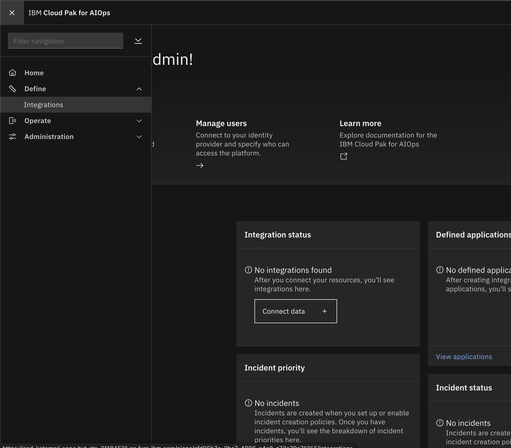

# Using Ticketing Template

Two things to consider changing.
- Bundle Artifacts for deploying to cluster.
- Connector code changes.
- Makefile: If needed Replace PLACEHOLDER_REGISTRY_ADDRESS with the one that you would be using

## Bundle Artifacts

Start with bundle-artifacts/prereqs/connectorschema.yaml file. 
- Add more kafka topics if required in spec.permissions.channels
- Add more form fields if required to the spec.schema and spec.uiSchema. 
- Add fields like password or tokens that needs to be encrypted to spec.encryptedFields
- Example of how mappings is provided. Change it accordingly to fit with the keys of the outbound system that is being added.
- The translations (ex: {{connector.common.form.uniqueID.label}} ) in ```bundle-artifacts/prereqs/connectorschema.yaml``` and images for tiles from connector-ui which is handled internally within IBM. You can use direct strings instead.
To add Kafka Topics uncomment topics bundle-artifacts/prereqs/kustomization.yaml and add topics to the bundle-artifacts/prereqs/topics.yaml file. Refer to the example provided.

## Connector
- Based on the connectorschema, try editing the Configuration.java(src/main/java/com/ibm/aiops/connectors/template/model/Configuration.java) in model.
- TicketConnector is the main reference point. Below are the main functions that needs to be updated to connect and create/update/close/poll the tickets from outbound system.
        - onConfigure -> Integration is created or updated. We also start data collection(polling) here when the data_flow is enabled.
        - notifyCreate -> Incident created.
        - notifyUpdate -> Incident updated
        - notifyClose -> Incident closed
notifyCreate, notifyUpdate, notifyClose should not block the execution for long periods of time. Once an action has been completed, the connector should emit a cloud event recording the completion state. For this reason we use queues to process the events.

IncidentActions -> Will deal with incident create, update and close actions to ticketing system. 
IssuePollingAction -> To pull the data from the ticketing system.
- Search for `Todo` and make changes at these places if needed

## Deploying & Testing
- Go to your OpenShift console.
- Create a secret in your OpenShift console `test-utilities-github-token` with your github credentials. The secret is used in bundlemanifest.yaml to pull the images from github.


- Try importing the yaml file in your OpenShift console by using [bundlemanifest.yaml](bundlemanifest.yaml) file and paste the content to deploy the connector.


- Once it is configured, go to installed operators and under AIOps Edge operator, check if the ticket-template exists. 
- Make sure your cluster has access to pull the docker image. In Secrets, search for pull-secret. 
- Go to AIOps UI -> Integrations UI

- Click on add integration, search for Ticket Template or by the display name ```spec.uiSchema.displayName``` you specified in [connectorschema.yaml](bundle-artifacts/prereqs/connectorschema.yaml) file and you should see a tile as Ticket Template.
- Select it, try to add an integration. You can select url as `https://api.github.com/repos/githubowner/yourreponame/issues` and provide your github token. 
- Once you save the integration, first it goes to Initializing, then Running after.
- Once the integration is Running. Go to `createIncident.md`. Trigger the incidents as specified in this file.
- If your integrations is in "unknown" status. Check the pod status in OpenShift console, if it says imagepullerror. Try to edit `pull-secret` as key/value pair in Secrets. Add Registry server address, Username and Password.
- You should see notify_create in the connector pod logs.
- Go to pods in cluster, search for ticket-template pod, you can check the logs here.

### Testing remotely
- To run the integration remotely (in your system for debugging), you can select remote option while creating the integration. Fill in the properties cp4waiops-connector-ticket-template/src/main/liberty/config/bootstrap.properties from the downloadable file that you obtained in the integration ui.
- In your system, under your ticketing template project, do `mvn clean` and `mvn install`
- To run: `mvn liberty:run`

