Make sure you set the event count increasing as a reason to generate an incident. Otherwise you need to modify the code to generate a new alert

## Incident Creation using Webhook

Create a Webhook in the Integration page
Search for webhook and select Generic Webhook
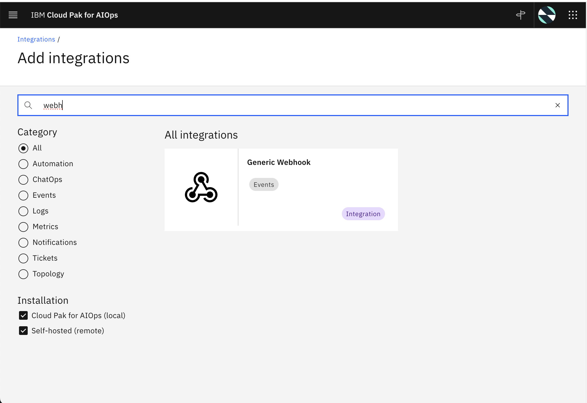
Click on Get Started 
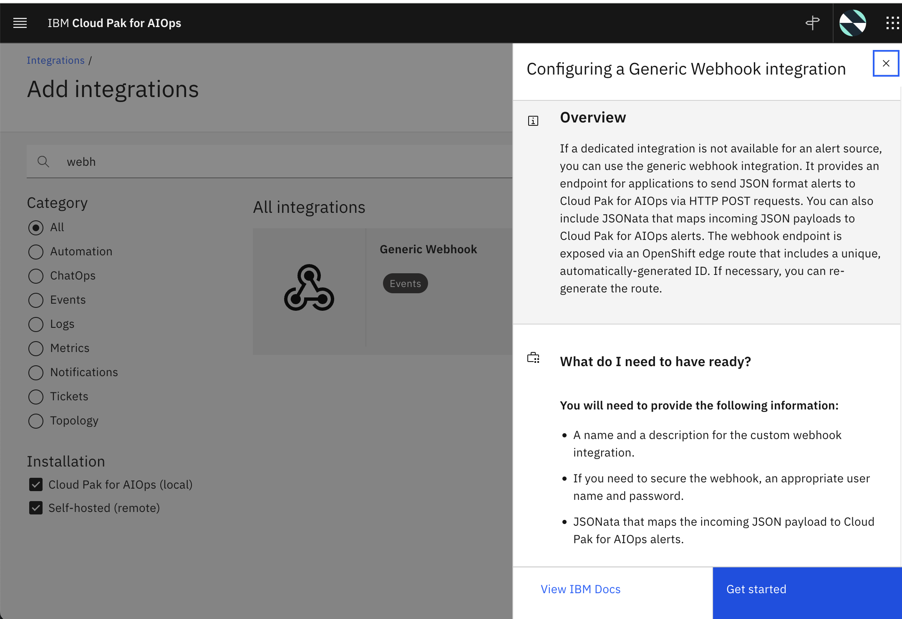
Give it some name and choose none as authentication. You can provide authentication if you would to here but you should pass the credentials when using curl command.
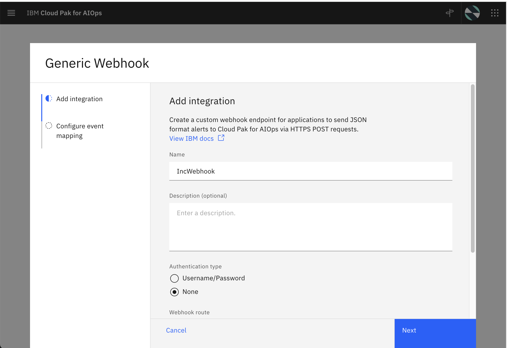
Click on Load Sample Mapping
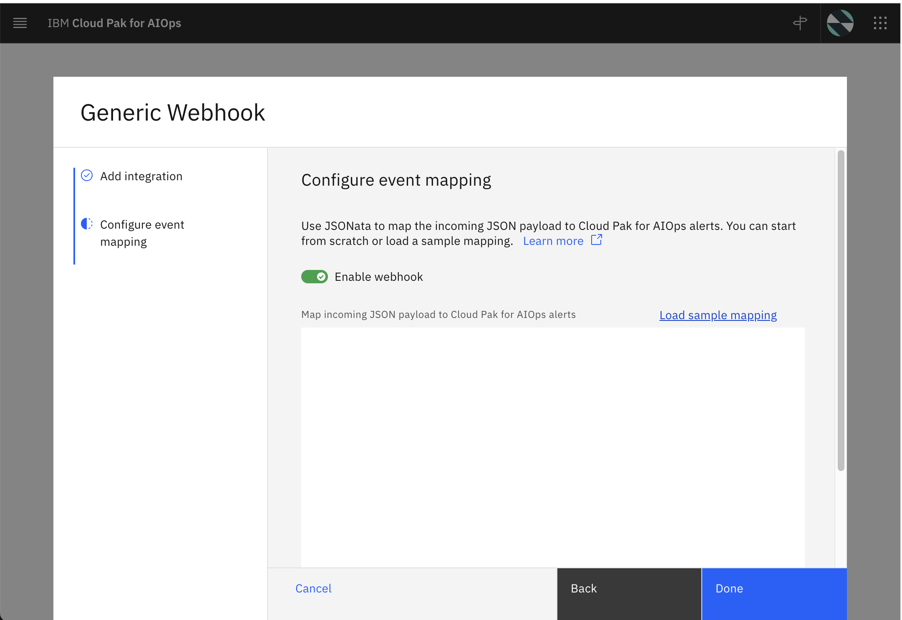
Select IBM Sev One from the dropdown and hit on Load Sample Mapping Button 
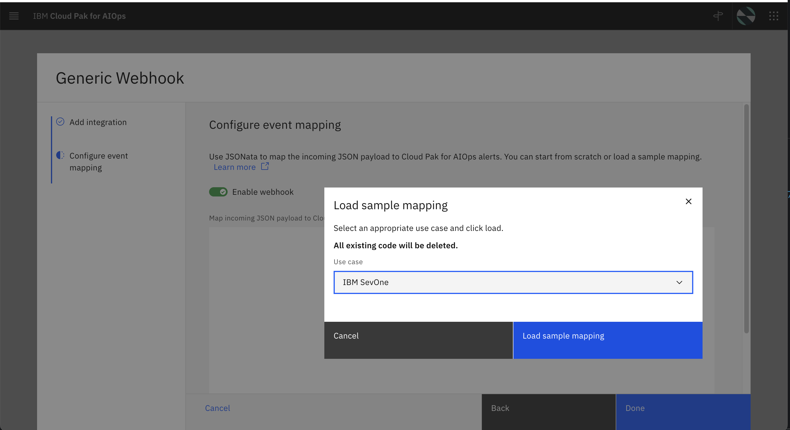
Give it some time and you will get to see the route. Copy the webhook route
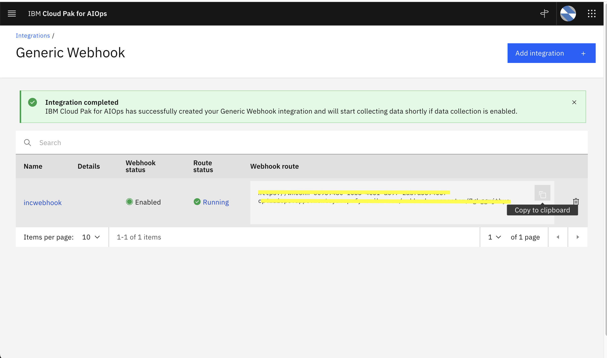

Change the titles in sevone-payload.json file in `/samples`
Be in this folder `cd samples/sevone-payload.json file` or the path where you have your sevone-payload.json file
Login to the cluster by `oc login`. 
For example `oc login https://api.cluster.cp.fyre.ibm.com:port -u username -p password -n namespace --insecure-skip-tls-verify=true`

`WEBHOOK_URL=paste webhook url here

curl -X POST --insecure \
-H 'Content-Type: application/json' ${WEBHOOK_URL} \
-d @./sevone-payload.json`


Trigger Incident and see the details in incident details page
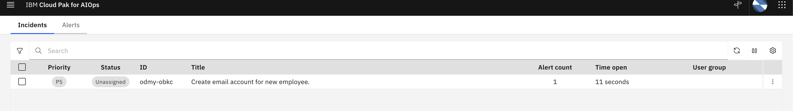

## Incident Creation using Automation actions

- Go to Automations page and click on Actions tab.
- Give it a name "postevent"
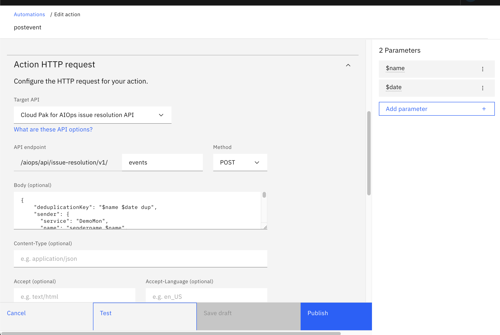
- Add two parameters from the right panel. 1. "name": Type String, with no default value. 2. "date" Type String, default value to current data in this format "2025-03-11T10:00:00.000Z".
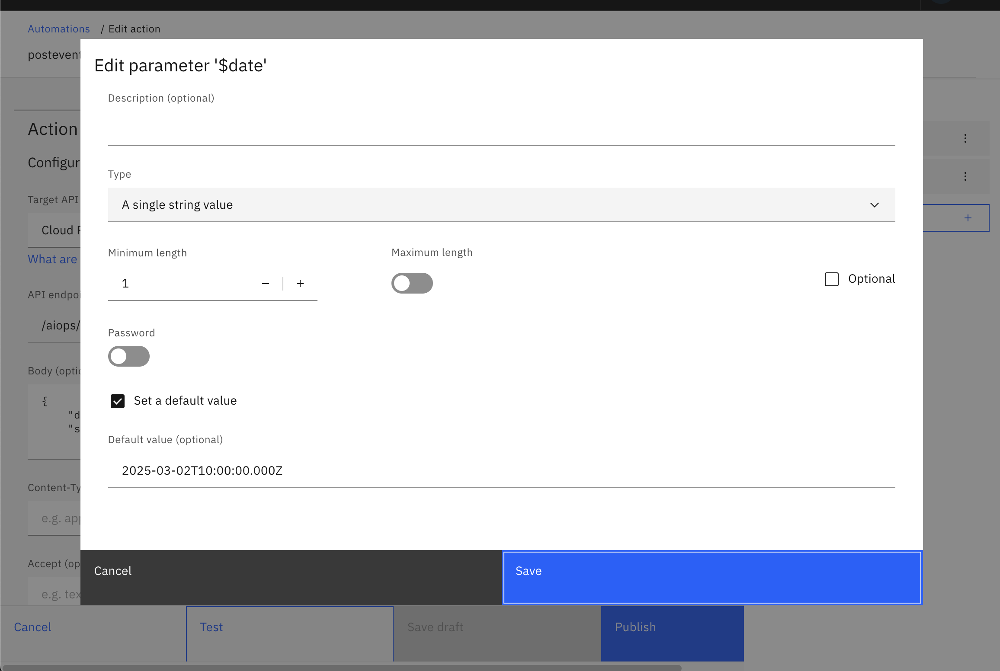
- Under Action HTTP Request: Select the target api from the dropdown to "Cloud Pak for AIOps issue resolution API".

- Enter "events" in the middle text box and "POST" in Method, under API endpoint.
- Give this in body:
```
{
    "deduplicationKey": "$name $date dup",
    "sender": {
      "service": "DemoMon",
      "name": "sendername $name",
      "type": "Netcool/OMNIbus"
    },
    "details": {
    "12345": "67890",
    "name": "test",
    "key1": "http://www.google.com",
    "sumAggregator": "ALL"
    },
    "resource": {
      "name": "$name $date resourcename",
      "type": "Service",
      "service": "https://myapp.example.com"
    },
    "type": {
      "classification": "$name $date test",
      "eventType": "problem"
    },
    "severity": 5,
    "summary": "$name $date",
    "occurrenceTime": "$date",
    "expirySeconds": 0
  }
  ```
- Hit Publish
- Go back to actions list and hit run
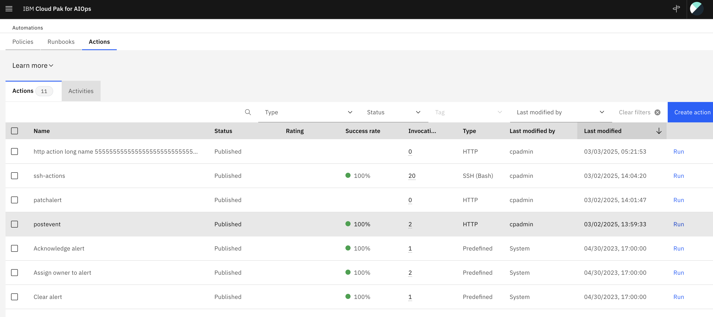
- Give it some name in the right side parameters tab and hit run. 
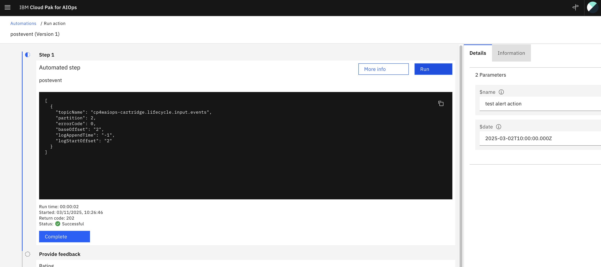
- This should create an alert and incident.


