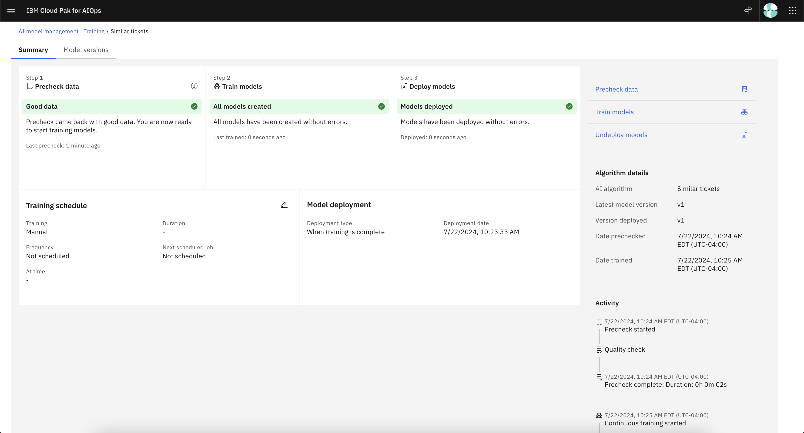

# JSONImporter
## Modify the Mapping
[JSONImporter.java](src/main/java/com/ibm/aiops/connectors/importer/JSONImporter.java) to match your data source's mapping.

Modify [sample.json](src/main/resources/sample.json) to include your sample data.

## Port Forward Elastic
Login to OpenShift

In one terminal, run the following:
```bash
export EL_USER=`oc get secret iaf-system-elasticsearch-es-default-user -o go-template --template="{{.data.username|base64decode}}"`
export EL_PWD=`oc get secret iaf-system-elasticsearch-es-default-user -o go-template --template="{{.data.password|base64decode}}"`
kubectl port-forward iaf-system-elasticsearch-es-aiops-0 9201:9200
```

## Working with Elastic
On the second terminal, run the following:
```bash
export EL_USER=`oc get secret iaf-system-elasticsearch-es-default-user -o go-template --template="{{.data.username|base64decode}}"`
export EL_PWD=`oc get secret iaf-system-elasticsearch-es-default-user -o go-template --template="{{.data.password|base64decode}}"`
curl -X POST --user $EL_USER:$EL_PWD https://localhost:9201/snowincident/_search -k
```

You can see if anything was put into the incident index (`snowincident`) before. If there are entries, this can affect your similar incident query.
```bash
curl -X DELETE --user $EL_USER:$EL_PWD https://localhost:9201/snowincident -k
```

If you had previously trained AI models, run:
```bash
curl -X DELETE --user $EL_USER:$EL_PWD https://localhost:9201/normalized-incidents-1000-1000 -k
```

If successful, you will see:
```bash
{"acknowledged":true}
```

## Running The Application
For running this Java program:
```bash
mvn install
export DIRECT_TO_SEARCH_PASSWORD=`oc get secret iaf-system-elasticsearch-es-default-user -o go-template --template="{{.data.password|base64decode}}"`
export DIRECT_TO_SEARCH_USERNAME=`oc get secret iaf-system-elasticsearch-es-default-user -o go-template --template="{{.data.username|base64decode}}"`
export DIRECT_TO_SEARCH_PORT="9201"
export DIRECT_TO_SEARCH_HOSTNAME="127.0.0.1"
mvn exec:java -Dexec.mainClass="com.ibm.aiops.connectors.importer.JSONImporter"
```

An example output is:
```bash
Valid incidents to insert: 10
```

Verify by calling:
```bash
curl -X POST --user $EL_USER:$EL_PWD https://localhost:9201/snowincident/_count -k
{"count":10,"_shards":{"total":1,"successful":1,"skipped":0,"failed":0}}%    
```

## Training and Testing Similar Incident
Train the AI model for Similar Incident and the sample will be successful. Only closed incidents are examined.


In a terminal window, run:
```bash
for i in {1..1000}; do oc port-forward svc/$(oc get svc | grep similar-incidents | awk '{print $1;}') 8000; done
```

In a second terminal, run the following, but replace `YOUR_USERNAME_HERE` and `YOUR_PASSWORD_HERE`:
```bash
ZENURL=`oc get route cpd -o json | jq -r .spec.host`
TOKEN=`curl -ks https://$ZENURL/icp4d-api/v1/authorize -H 'Content-Type: application/json' -d '{"username": "YOUR_USERNAME_HERE", "password": "YOUR_PASSWORD_HERE"}'`
export TOKEN=`echo $TOKEN | jq '.token'`
TOKEN=`echo "$TOKEN" | tr -d '"'`
echo $TOKEN 
```

Test similar incident (modify the `text` in the `curl` command to test different incident texts)
```bash
curl --location 'https://127.0.0.1:8000/v2/similar_incidents/search' \
-H 'Content-Type: application/json' \
-H "Authorization: Bearer $TOKEN" \
-d '{
  "story_id": "1",
  "application_id": "1000",
  "application_group_id": "1000",
  "text": "Server not running"
}' -k

```

You will get the output (made pretty for readability):
```json
{
    "similar_incidents": [
        {
            "title": "Server not running.",
            "incident_id": "1f0f3686-ba2a-444a-b3d2-c3e01047f638",
            "source_incident_id": "INCIDENTID02",
            "url": "https://example.com/incident/INCIDENTID02",
            "explanation": "Based on similarity from query and incidents",
            "resolution": "Fixed manually by restarting the server several times",
            "score": 4.5393684e-31,
            "started_at": "1970-01-12T05:20:54+00:00",
            "closed_by": "",
            "actions": [
                {
                    "action": {
                        "text": "restarting",
                        "begin_offset": 18,
                        "end_offset": 28
                    },
                    "components": [
                        {
                            "text": "server",
                            "begin_offset": 33,
                            "end_offset": 39
                        }
                    ]
                }
            ]
        },
        {
            "title": "Server is frozen",
            "incident_id": "9a09346e-fcac-45bc-9e07-0ac96c21f823",
            "source_incident_id": "INCIDENTID07",
            "url": "https://example.com/incident/INCIDENTID07",
            "explanation": "Based on similarity from query and incidents",
            "resolution": "Force shutdown the server and let it sit for 5 minutes before turning it back on",
            "score": 9.6339497e-32,
            "started_at": "1970-01-12T05:20:54+00:00",
            "closed_by": "",
            "actions": []
        },
        {
            "title": "Server under denial of service attack",
            "incident_id": "4d7f18b7-67da-4ed4-a315-65ad115d0840",
            "source_incident_id": "INCIDENTID10",
            "url": "https://example.com/incident/INCIDENTID10",
            "explanation": "Based on similarity from query and incidents",
            "resolution": "Blocked problematic IPs via filter to lighten the load",
            "score": 6.759733e-32,
            "started_at": "1970-01-12T05:20:54+00:00",
            "closed_by": "",
            "actions": []
        }
    ],
    "recommended_actions": [
        {
            "incident_id": "1f0f3686-ba2a-444a-b3d2-c3e01047f638",
            "sentence": "Fixed manually by restarting the server several times",
            "actions": [
                {
                    "action": {
                        "text": "restarting",
                        "begin_offset": 18,
                        "end_offset": 28
                    },
                    "components": [
                        {
                            "text": "server",
                            "begin_offset": 33,
                            "end_offset": 39
                        }
                    ]
                }
            ]
        }
    ]
}
```

# JSONImporterChangeRequest


## Change Risk Schema
Change Risk
| Name   |      Description    | Type  |  Example(s) |
|----------|:-------------:|:-------------:|------:|
| sys_id |  Unique identifier in the ITSM system | String | 20de36ec73d423002728660c4cf6a7d6 |
| number |    A human readable identifier |String|  CHG0002001 |
| assigned_to | Who the change request is assigned to | String |   Bob Stevens |
| sys_created_by | Who the change request was created by | String |   Paul Brown |
| sys_domain | What domain this change falls into. Different domains are separated | String |   global |
| business_service | What business service owns the change request | String |   Retail |
| type | What type of change request type | String | Emergency or Normal   |
| state | What type of change request state. The state must be Closed for the change request to be used for training | String | Closed, Canceled, or New    |
| short_description | A short summary of the change request | String | Update server from 10.0 to 10.1    |
| impact | The impact of the change request | String | 3 - Low, 2 - Medium, or 1 - High    |
| reason | The reason for the change request | String | Security fix    |
| justification | The impact of the change request | String | Server requires critical security update from the upgrade    |
| description | The description of the change request | String | Server name is example and the finance team needs to be notified one day before it goes offline    |
| backout_plan | The backout plan in case change request fails | String | Undo the upgrade from 10.1 to 10.0    |
| close_code | The close code of the change request. Must be Successful, Successful with issues, or Unsuccessful | String | Successful, Successful with issues, or Unsuccessful    |
| close_notes | The close notes | String | Implemented   |
| closed_at | The date and time that it is closed  | String | 2023-01-24 13:07:15   |

## Port Forward Elastic
Login to OpenShift

In one terminal, run the following:
```bash
export EL_USER=`oc get secret iaf-system-elasticsearch-es-default-user -o go-template --template="{{.data.username|base64decode}}"`
export EL_PWD=`oc get secret iaf-system-elasticsearch-es-default-user -o go-template --template="{{.data.password|base64decode}}"`
kubectl port-forward iaf-system-elasticsearch-es-aiops-0 9201:9200
```

## Working with Elastic
On the second terminal, run the following:
```bash
export EL_USER=`oc get secret iaf-system-elasticsearch-es-default-user -o go-template --template="{{.data.username|base64decode}}"`
export EL_PWD=`oc get secret iaf-system-elasticsearch-es-default-user -o go-template --template="{{.data.password|base64decode}}"`
curl -X POST --user $EL_USER:$EL_PWD https://localhost:9201/snowchangerequest/_search -k
```

You can see if anything was put into the incident index (`snowchangerequest`) before. If there are entries, this can affect your similar incident query.
```bash
curl -X DELETE --user $EL_USER:$EL_PWD https://localhost:9201/snowchangerequest -k
```

If successful, you will see:
```bash
{"acknowledged":true}
```

## Running The Application
For running this Java program:
```bash
mvn install
export DIRECT_TO_SEARCH_PASSWORD=`oc get secret iaf-system-elasticsearch-es-default-user -o go-template --template="{{.data.password|base64decode}}"`
export DIRECT_TO_SEARCH_USERNAME=`oc get secret iaf-system-elasticsearch-es-default-user -o go-template --template="{{.data.username|base64decode}}"`
export DIRECT_TO_SEARCH_PORT="9201"
export DIRECT_TO_SEARCH_HOSTNAME="127.0.0.1"
mvn exec:java -Dexec.mainClass="com.ibm.aiops.connectors.importer.JSONImporterChangeRequest"
```

An example output is:
```bash
Valid change requests to insert: 15
```

Verify by calling:
```bash
curl -X POST --user $EL_USER:$EL_PWD https://localhost:9201/snowchangerequest/_count -k
{"count":15,"_shards":{"total":1,"successful":1,"skipped":0,"failed":0}}%    
```

Note: to prevent the error in the pod `precheck`

```
"Insufficient number of problematic change tickets for a good model. For a closed change ticket count less or equal to 150, you need at least 3 problematic tickets. For a closed change ticket count greater than 150, you need at least 2 percent of change tickets to be problematic. A problematic change ticket is defined as a change ticket that can either be associated with incident tickets or have an 'unsuccessful' value set in the change ticket close code field."
```

Make sure your data has the correct number of `Unsuccessful ` close codes

Once the data for change request is in, you also need the incidents trained from before. If there are no incidents, change risk training is required. If you had not inserted the incident training data before, make sure to do it now.

After, you can run:
```bash
oc get secret kafka-secrets -o "jsonpath={.data['ca\.crt']}" | base64 -d > ca.crt
export KAFKA_USER=`oc get secret kafka-secrets -o go-template --template="{{.data.user|base64decode}}"`
export KAFKA_PWD=`oc get secret kafka-secrets -o go-template --template="{{.data.password|base64decode}}"`
export KAFKA_BOOTSTRAP=`oc get routes iaf-system-kafka-bootstrap -o=jsonpath='{.status.ingress[0].host}{"\n"}'`
```

The `input.json` is in the same directory as this `README.md`. Also you need kcat (https://docs.confluent.io/platform/current/tools/kafkacat-usage.html). Run:
```bash
kcat -X security.protocol=SASL_SSL -X ssl.ca.location=ca.crt -X sasl.mechanisms=SCRAM-SHA-512 -X sasl.username=$KAFKA_USER -X sasl.password=$KAFKA_PWD -b $KAFKA_BOOTSTRAP:443 -P -t cp4waiops-cartridge.changerequest -P input.json
```

Feel free to modify `input.json` to match your data.

Open the pod with prefix `aimanager-aio-change-risk` to see:
```log
2024-10-03 20:58:38 Posting high-risk event to cp4waiops-cartridge.lifecycle.input.events: {"id": "4bd051b0-a210-489f-892e-ace5be32a4a2", "sender": {"service": "change-risk-service", "name": "change-risk", "type": "change-risk"}, "resource": {"name": "", "sourceId": "CHG0030003", "type": "change-request"}, "type": {"classification": "change risk analysis", "condition": "Confidence 53%", "eventType": "problem"}, "severity": 3, "summary": "High-risk change CHG0030003", "details": {"body_html": "IBM Cloud Pak for AIOps has detected that this change request is at [code]<b>HIGH RISK</b>[/code]. \n\n Confidence: [code]<b>53%</b>[/code] \n\n [code]<b>Most relevant change requests</b>[/code]: \n\n[code]<a href='https://example.com/change_request.do?sysparm_query=number=chg05'>chg05</a> was closed as being unsuccessful. The closing remarks of the change ticket were :'Chair was still squeaky. Chair was tossed into the trash'.[/code] \n\n [code]<a href='https://example.com/change_request.do?sysparm_query=number=chg15...
2024-10-03 20:58:38 Broadcasted message to topic cp4waiops-cartridge.lifecycle.input.events at offset: 0
```
